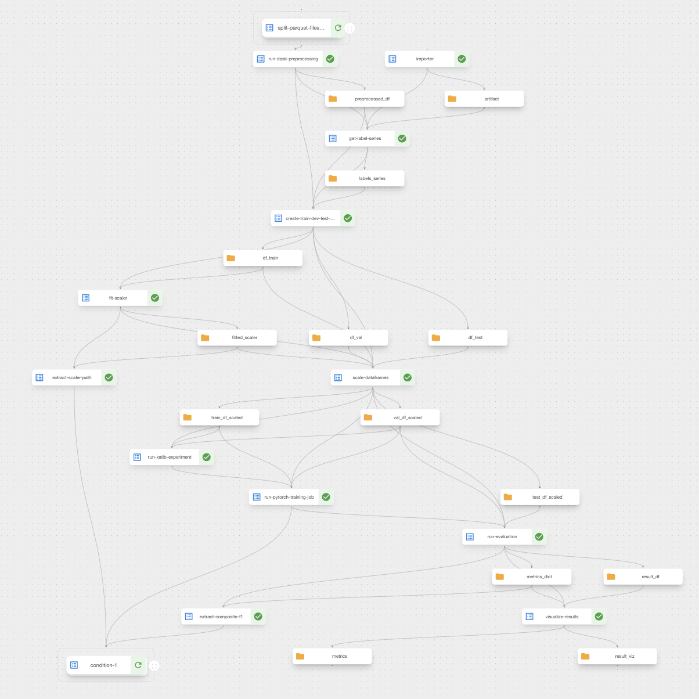
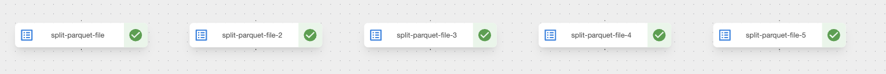
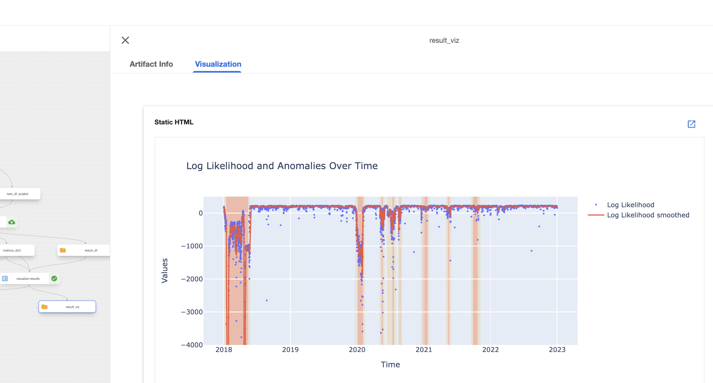
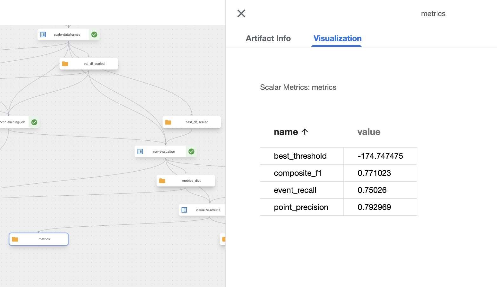
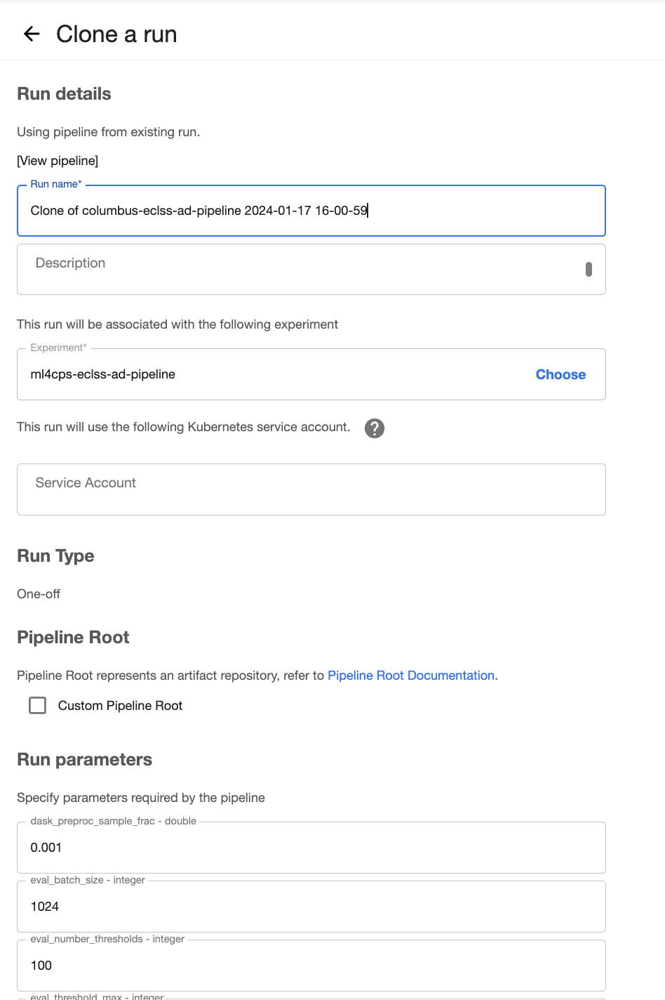
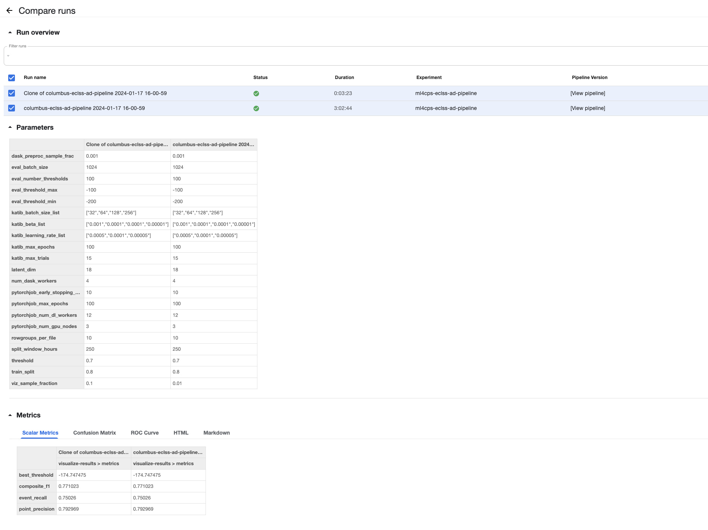
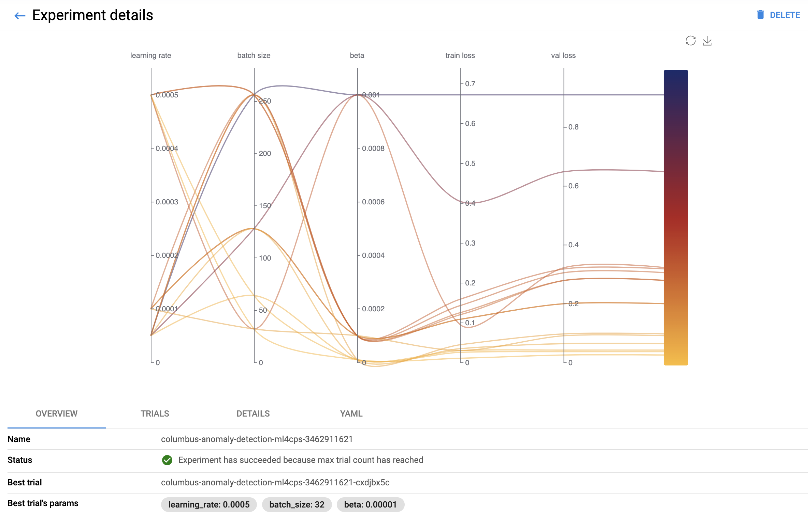
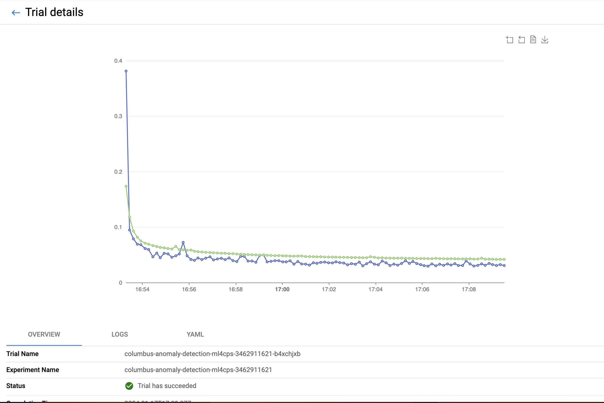
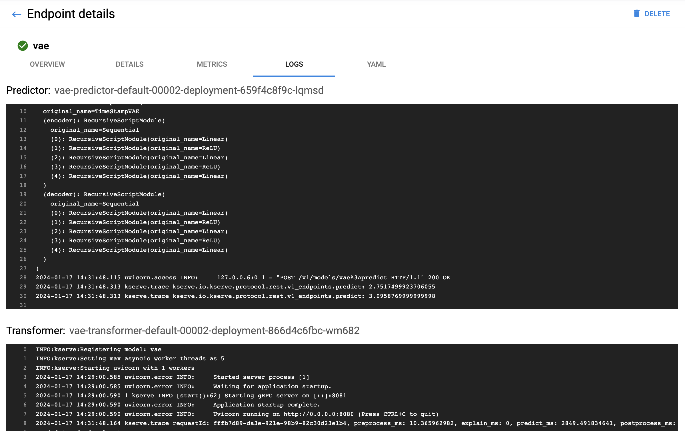

# Code for ML4CPS Paper on Kubeflow

This repository hosts the code for our paper titled "End-to-End MLOps
Integration: A Case Study with ISS Telemetry Data". The abstract of our paper is
as follows (a full reference will be provided upon publication):

"Kubeflow integrates a suite of powerful tools for ML software development and
deployment. While these tools are often demonstrated individually, our paper
explores their collective effectiveness within a unified end-to-end workflow. We
present a case study on anomaly detection using telemetry data from the
International Space Station (ISS), highlighting the integration of various
tools—Dask, Katib, PyTorch Operator, and KServe—within a single Kubeflow
Pipelines (KFP) workflow."

This README is divided into two main sections. The first part serves as an
appendix to our paper, offering a more detailed description of the implemented
pipeline. This includes screenshots from the Kubeflow UI, accompanied by brief
explanatory notes. The second part provides a traditional README, explaining the
repository setup, installation instructions, and guidelines for running the
experiments.

## Appendix: Detailed Pipeline Description and Screenshots

### Pipeline DAG
The image below shows a screenshot of the Directed Acyclic Graph (DAG) of our
KFP pipeline. The boxes with yellow directory icons represent pipeline artifacts
stored in MinIO. The boxes containing blue icons and green checkmarks represent
the pipeline steps. In the Kubeflow documentation, these steps are referred to
as 'Tasks.' Each Task represents the execution of a Kubeflow Pipelines
component, consisting of a container image, a command, and input/output
specifications. If parallelization is possible according to the DAG, tasks are
executed concurrently. If a task has previously been executed with the same
configuration, the results are cached, meaning they are loaded from the
precomputed artifacts in MinIO.





The following screenshot shows the sub-pipeline visualized at the top of
the main DAG (`split-parquet-files`). In this DAG, tasks that split yearly archives into smaller files
run in parallel.



Model deployment with KServe occurs only if the trained model achieves a
composite F score higher than a user-defined threshold. This pipeline is also
represented as a sub-pipeline in the main DAG (lower left of the main DAG:
`condition-1`):


### KFP Visualizations
In KFP, tasks can have special output types that allow visualizations to be
displayed within the Kubeflow UI. We utilized this feature in our case study to
visualize the model evaluation. For instance, we plotted the likelihood of our
VAE for anomaly detection over time, as described in the paper. The same plot
can be rendered as HTML and displayed as an output of the KFP task in the UI.
Here is a screenshot illustrating this:



Moreover, KFP offers the capability to display metrics in a similar manner,
which we also utilized in our case study:



### Cloning and Comparing Pipeline Runs
Pipeline tasks can be executed with various inputs. This also applies to entire
pipelines, allowing them to be rerun with different configurations, such as for
parameter tuning or retraining in response to data drift. These reruns can be
automatically triggered, but KFP also provides a UI feature to reconfigure and
restart the pipeline:



Finally, the UI allows comparing different runs of a pipeline in terms of their
outputs:



### Katib Experiment Visualization

Katib automatically generates a hyperparameter tuning plot, which is displayed
in the UI.



Additionally, each trial in Katib (a trial being a run of training with a set of
hyperparameters) has its own view. In this view, the course of logged metrics
over time is plotted by default (in our case, training and validation loss).
There is also a tab showing the actual standard out logs of the trial pod in the
UI.



### Kserve
In the KServe UI, logs from individual model pods are displayed among other
features. In our case, this includes the logs of the Predictor that serves the
PyTorch Model, and the Transformer, responsible for scaling the data.




## Technical Readme
### Project Structure

All necessary components for defining, compiling, and executing the pipeline are contained within a single Python package named `pipeline`.
The `container_component_src` directory contains Python code for custom container images used for various tasks, including Dask workers, PyTorch training jobs, Katib hyperparameter tuning, and more.
The idea is to use a single image for all these applications, defining individual commands for different tasks.
This setup includes a single `Dockerfile` at the root of this directory and a `.gitlab-ci.yml` file for automated builds in GitLab.

A `config.toml` file is used to store constants and path configurations.
The project employs `Poetry` for package management.
All Jupyter notebooks, such as those for data exploration and analysis, are located in the `notebooks` directory.
The `local_data` directory, while empty, is intended for local development.

The repository structure is outlined below:

```text
.
├── config.toml
├── container_component_src
│   ├── dask_preprocessor
│   │   ├── __init__.py
│   │   └── preprocessor.py
│   ├── model
│   │   ├── __init__.py
│   │   ├── callbacks.py
│   │   ├── datamodule.py
│   │   └── lightning_module.py
│   ├── __init__.py
│   ├── main.py
│   └── utils.py
├── Dockerfile
├── LICENSE
├── local_data
├── notebooks
│   └── 01_exploration.ipynb
├── pipeline
│   ├── auth_session.py
│   ├── compile_and_run_pipeline.py
│   ├── components.py
│   ├── __init__.py
│   ├── pipeline_definition.py
├── poetry.lock
├── pyproject.toml
├── pyproject.toml
└── README.md
```

### Installation

To install the Python project locally, execute the following command:

```sh
poetry install
```

This command will set up the project with all necessary dependencies as defined in the pyproject.toml file.

### Building the Image

The Docker image for this project is set up to build automatically via GitLab's CI/CD pipeline upon pushing your code.
The CI pipeline builds the Docker image with two tags: latest and a short hash of the corresponding commit.
The registry URL for the image is specified in the config.toml file.

You can also build the image locally using the following command:

```sh
docker build -t <example-image-name> .
```

After building the image locally, push it to your registry:

```sh
docker login
docker push <example-image-name>
```

## Pipeline Execution

There are multiple ways to execute the Kubeflow pipeline:

#### From a Kubeflow Notebook (KF-Notebook)

Within a Kubeflow notebook environment in the cluster, all necessary environment variables and permissions should already be set. After building and pushing the image to the specified registry (as noted in config.toml), you can run the pipeline with:

```sh
poetry run python pipeline/compile_and_run_pipeline.py
```

#### Running Remotely

You can also execute the pipeline from your local development machine.
To do so, ensure to forward the MinIO port to your local machine.
This can be done using the following kubectl command:

```sh
kubectl port-forward -n minio svc/defaulttenant-hl 9000:9000
```

Alternatively, tools like k9s or Lens can be used for port forwarding.
If you lack the required permissions, please contact your system administrator.

To run the pipeline locally (from a remote machine outside the cluster), create a `.env` file in the root of this project with the following content:

```toml
KUBEFLOW_ENDPOINT='https://example-url'
KUBEFLOW_USERNAME='example.user@prokube.ai'
KUBEFLOW_PASSWORD='examplepassword'
KUBEFLOW_NAMESPACE='example-user'
AWS_SECRET_ACCESS_KEY='example-minio-password'
AWS_ACCESS_KEY_ID='example-minio-user'
S3_USE_HTTPS=0
S3_ENDPOINT='localhost:9000'
S3_VERIFY_SSL=0
```

Replace the placeholder values with your actual credentials and URLs.
Also add the option `--remote` the python command like so:

```bash
poetry run python pipeline/compile_and_run_pipeline.py --remote
```

#### From the Kubeflow UI

The pipeline can be executed directly from the Kubeflow UI.
This method is convenient but requires either that the pipeline has been previously run in the same namespace, or that you have access to the compiled pipeline YAML file.

### Accessing the deployed model

Final result of the pipeline is a KServe [InferenceService](https://kserve.github.io/website/0.11/get_started/first_isvc/)
that provides a REST API where the model can be queried. The full URL of the model API can be found in the UI or by running:
```shell
kubectl get inferenceservice -n samo-turk vae -o=jsonpath='{.status.address.url}'
```
*Note that this is internal URL reachable from the cluster. Configuring model access from the outside is beyond the 
scope.*  

Model can be queried within the cluster with:
```shell
# KServe<=0.10
curl -H "Content-Type: application/json" -k "<internal-url>"  -d @request.json
# KServe>=0.11
curl  -H "Content-Type: application/json" -k <internal-url>/v1/models/<model-name>:predict -d @request.json
```
where `request.json` has the following structure:
```json
{"instances": [{"Column 1":  0, ...}]}
```


### How to Contribute

1. **Type Hinting**: Always use type hinting in Python code.
2. **Docstrings**: Lets try to follow [Google's style guide for Python docstrings](https://google.github.io/styleguide/pyguide.html).
3. **Branching and Commits**:
   - Create a new branch for your contribution.
   - Clean up your commits to maintain a clear history.
   - Rebase your branch to the latest master before submitting a pull request.

#### Random collection of commands:

Run Dask preprocessing locally (from within a kf-notebook), e.g. for debugging.

```bash
poetry run python container_component_src/main.py run_dask_preprocessing \
--partitioned-telemetry-paths "s3://eclss-data/telemetry/partitioned-telemetry/*/*" \
--sample-frac 0.001 \
--df-out-path "./local_data/df_dask_out.parquet" \
--timestamp-col "normalizedTime" \
--minio-endpoint "http://minio.minio" \
--dask-worker-image "gitlab.kiss.space.unibw-hamburg.de:4567/kiss/code-ml4cps-paper/columbus-ad:commit-c2f04ede" \
--num-dask-workers 4
```

Install ipykernel for this virtual environment:

```sh
poetry run ipython kernel install --name "ml4cps" --user
```

Run Pytorch trianing locally in a notebook pod
```sh
poetry run python container_component_src/main.py run_training \
  --train-df-path "minio://mlpipeline/v2/artifacts/columbus-eclss-ad-pipeline/cbce7a80-12a3-4b6b-a8cf-d72110f754ac/scale-dataframes/train_df_scaled" \
  --val-df-path "minio://mlpipeline/v2/artifacts/columbus-eclss-ad-pipeline/cbce7a80-12a3-4b6b-a8cf-d72110f754ac/scale-dataframes/val_df_scaled" \
  --seed 42 \
  --batch-size 32 \
  --latent-dim 10 \
  --hidden-dims 100 \
  --beta 0.5 \
  --lr 0.001 \
  --early-stopping-patience 30 \
  --max-epochs 10 \
  --num-gpu-nodes 1 \
  --run-as-pytorchjob False \
  --model-output-file "local_test_model" \
  --num-dl-workers 12
```

Run evaluation locally in a notebook pod
```sh
poetry run python container_component_src/main.py run_evaluation \
  --val-df-path "minio://mlpipeline/v2/artifacts/columbus-eclss-ad-pipeline/af29dcf9-e43e-4e95-951a-83120beb60dc/scale-dataframes/val_df_scaled" \
  --test-df-path "minio://mlpipeline/v2/artifacts/columbus-eclss-ad-pipeline/af29dcf9-e43e-4e95-951a-83120beb60dc/scale-dataframes/test_df_scaled" \
  --batch-size 1024 \
  --model-path "eclss-model-bucket/pytorch-job_20231228_110719" \
  --device "cuda" \
  --result-df-path 'local_data/results_df.parquet'\
  --metrics-dict-path 'local_data/metrics.json' \
  --threshold-min -1000 \
  --threshold-max 0 \
  --number-thresholds 1000 \
  --label-col-name "Anomaly" \
  --likelihood-mse-mixing-factor 0.001
```
